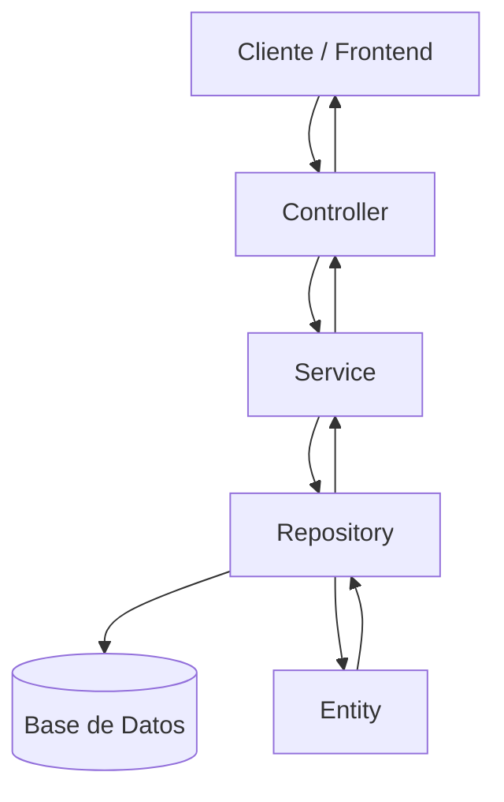
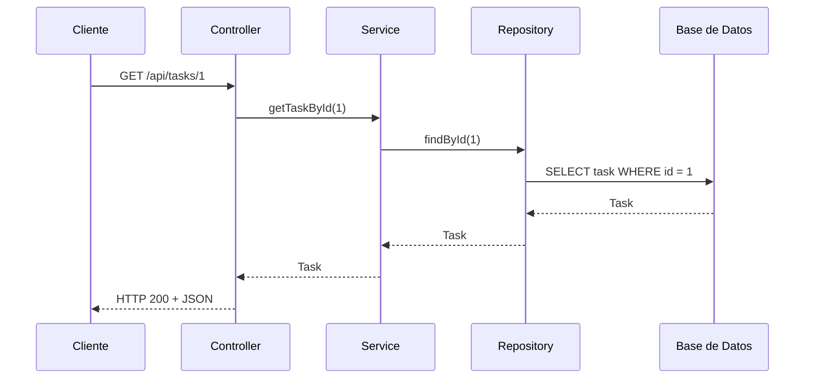

# Desarrollo Fullstack – Semana 6

## Arquitectura en capas de una API

### 1. Caso seleccionado

Se desarrollará una **API REST para la gestión de tareas**.

La aplicación permitirá que un usuario pueda crear, consultar, actualizar y eliminar tareas. Cada tarea tendrá información como título, descripción, estado y fecha de creación.

---

## 2. Arquitectura en capas

La API estará organizada utilizando las siguientes capas:



Flujo principal:

```text
Cliente
   ↓
Controller
   ↓
Service
   ↓
Repository
   ↓
Entity / Base de datos
```

---

## 3. Responsabilidad de cada capa

### Controller

El **Controller** recibe las solicitudes HTTP realizadas por el cliente.

En este caso se encargará de recibir peticiones relacionadas con las tareas, por ejemplo:

* Crear una tarea.
* Consultar las tareas.
* Actualizar una tarea.
* Eliminar una tarea.

El Controller no debe contener la lógica principal del negocio, sino que delega esta responsabilidad al Service.

Ejemplo:

```java
@RestController
@RequestMapping("/api/tasks")
public class TaskController {
}
```

---

### Service

El **Service** contiene la lógica de negocio de la aplicación.

Para la API de tareas puede encargarse de:

* Validar que una tarea tenga un título.
* Buscar una tarea antes de actualizarla.
* Verificar que una tarea exista antes de eliminarla.
* Cambiar el estado de una tarea.
* Coordinar las operaciones entre Controller y Repository.

Ejemplo:

```java
@Service
public class TaskService {
}
```

---

### Repository

El **Repository** es responsable de comunicarse con la base de datos.

Permite realizar operaciones como:

* Guardar tareas.
* Consultar tareas.
* Buscar una tarea por su ID.
* Actualizar información.
* Eliminar tareas.

Ejemplo utilizando Spring Data JPA:

```java
@Repository
public interface TaskRepository extends JpaRepository<Task, Long> {
}
```

---

### Entity

La **Entity** representa los datos que serán almacenados en la base de datos.

En este caso la entidad `Task` puede tener los siguientes atributos:

```java
@Entity
public class Task {

    @Id
    @GeneratedValue(strategy = GenerationType.IDENTITY)
    private Long id;

    private String title;

    private String description;

    private String status;
}
```

Esta entidad podría generar una tabla similar a:

| id | title             | description           | status    |
| -- | ----------------- | --------------------- | --------- |
| 1  | Realizar taller   | Arquitectura en capas | PENDING   |
| 2  | Estudiar API REST | Repasar Spring Boot   | COMPLETED |

---

## 4. Endpoint de ejemplo

Para consultar una tarea específica se puede utilizar el siguiente endpoint:

```http
GET /api/tasks/1
```

El objetivo es obtener la tarea que tenga el identificador `1`.

### Recorrido del endpoint



El flujo sería:

**1. Cliente**

Realiza la petición:

```http
GET /api/tasks/1
```

**2. Controller**

Recibe la petición y llama al Service.

```java
@GetMapping("/{id}")
public Task getTask(@PathVariable Long id) {
    return taskService.getTaskById(id);
}
```

**3. Service**

Recibe el ID, ejecuta la lógica necesaria y solicita la información al Repository.

```java
public Task getTaskById(Long id) {
    return taskRepository.findById(id)
            .orElseThrow();
}
```

**4. Repository**

Realiza la consulta en la base de datos:

```java
taskRepository.findById(id);
```

**5. Entity**

El resultado de la base de datos se representa mediante un objeto de tipo `Task`.

Finalmente, la API puede devolver:

```json
{
  "id": 1,
  "title": "Realizar taller",
  "description": "Arquitectura en capas",
  "status": "PENDING"
}
```

---

## 5. Conclusión

La arquitectura en capas permite separar las responsabilidades de una API. El **Controller** recibe las solicitudes HTTP, el **Service** procesa la lógica de negocio, el **Repository** se comunica con la base de datos y la **Entity** representa la información almacenada.

Esta separación facilita el mantenimiento, las pruebas y la modificación del sistema, debido a que cada capa tiene una responsabilidad específica.
